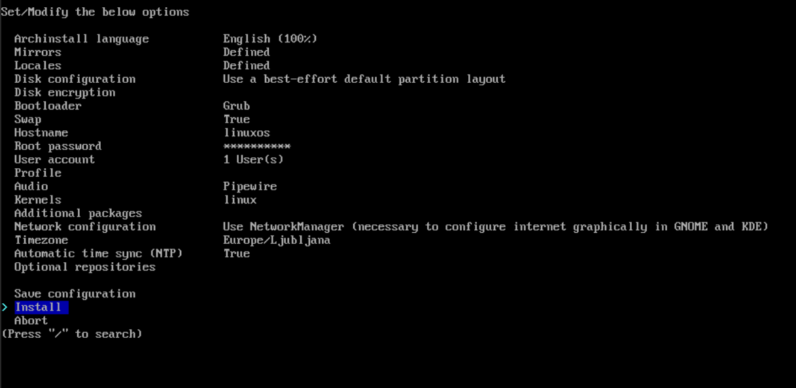

https://archlinux.org/

https://archlinux.org/download/

1. 

2. 





 after installing type ```exit```
 and then ```shutdown -h now```
 

then start again and login as user you created

 

 as you can see GDM is not started yet. this is because we didnt link (enabled system service) it

```sudo systemctl enable gdm.service```

 

 ```sudo systemctl start gdm.service```

  

desc env

- gnome (default) + GDM (display manager)
- kde


select grub for bootloader

sudo pacman -S neofetch